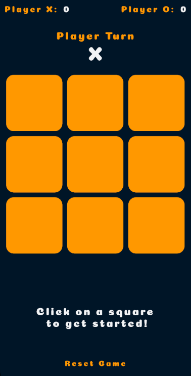
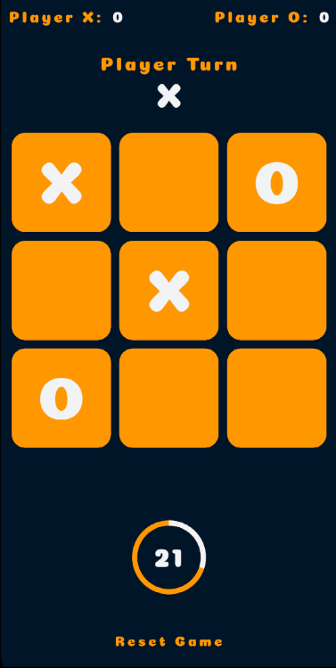
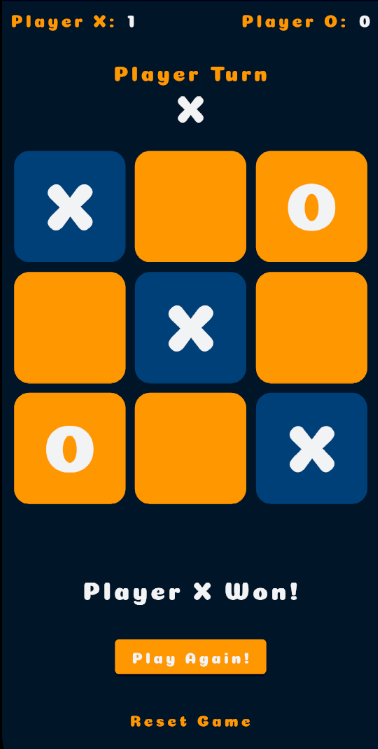

<h1 align="center">
  <br>
  
  <br>
  Tic Tac Toe  <br>
</h1>

<h4 align="center">Simple tictactoe project developed in <a href="https://flutter.dev" target="_blank">Flutter</a> for Android and iOS device.</h4>

<p align="center">
  <a href="#key-features">Key Features</a> •
  <a href="#how-to-use">How To Use</a> •
  <a href="#download">Download</a> •
  <a href="#credits">Credits</a> •
  <a href="#license">License</a>
</p>

<p align="center">
  <br>
  
  
  
</p>

## Key Features

* Time counter for each match
* Point count for each player
* Automatic start of the game when you first click on the board
* Restart counting button

## How To Use

To clone and run this application, you'll need [Git](https://git-scm.com) and [Flutter](https://docs.flutter.dev/get-started/install) installed on your computer. From your command line:

```bash
# Clone this repository
$ git clone https://github.com/luizgfalqueto/tic-tac-toe.git

# Go into the repository
$ cd tictactoe

# Install dependencies
$ flutter pub get

# Run the app
$ flutter run
```

> **Note**
> Please feel free to contribute to the project.
---

> GitHub [@luizgfalqueto](https://github.com/luizgfalqueto) &nbsp;&middot;&nbsp;
> Linkedin [@luizgfalqueto](https://www.linkedin.com/in/luizgfalqueto/) &nbsp;&middot;&nbsp;
> Instagram [@luizgfalqueto](https://www.instagram.com/luizgfalqueto/?hl=en)
